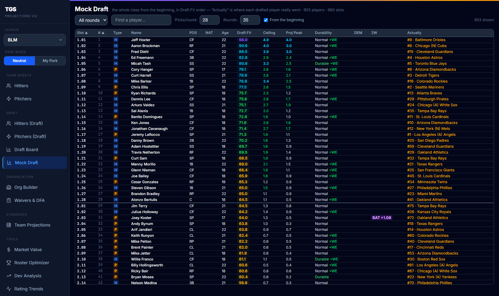
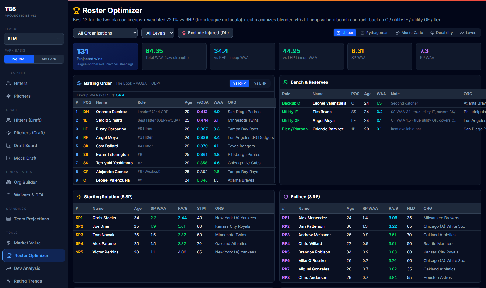
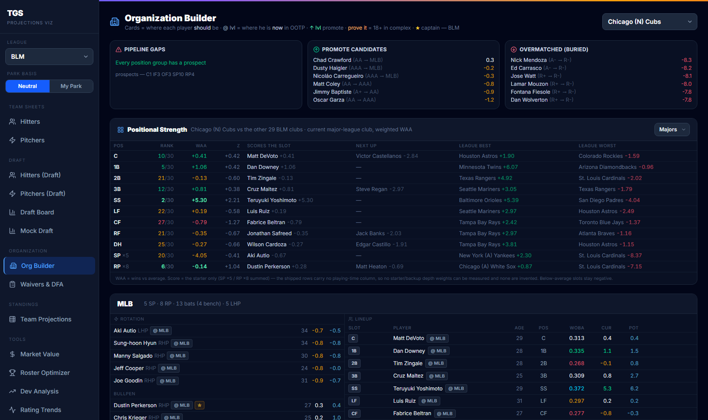
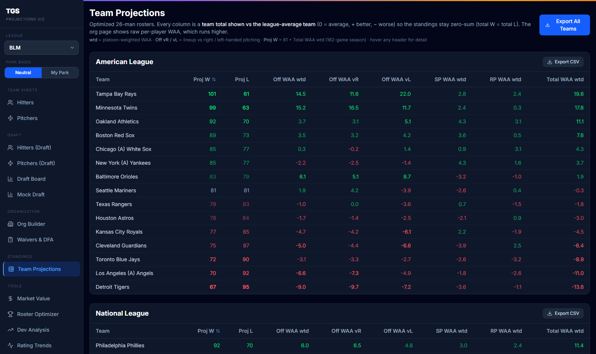
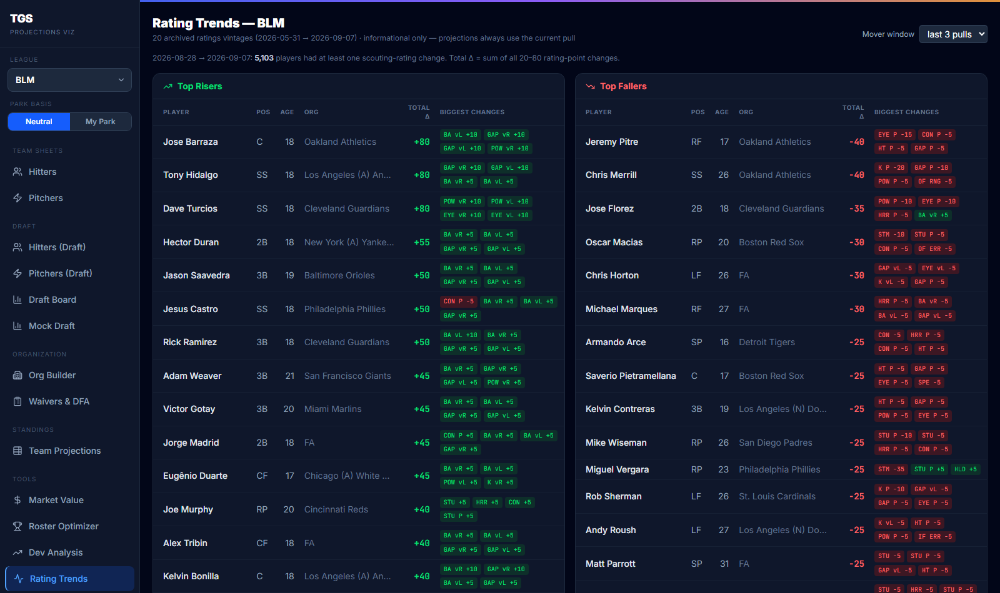
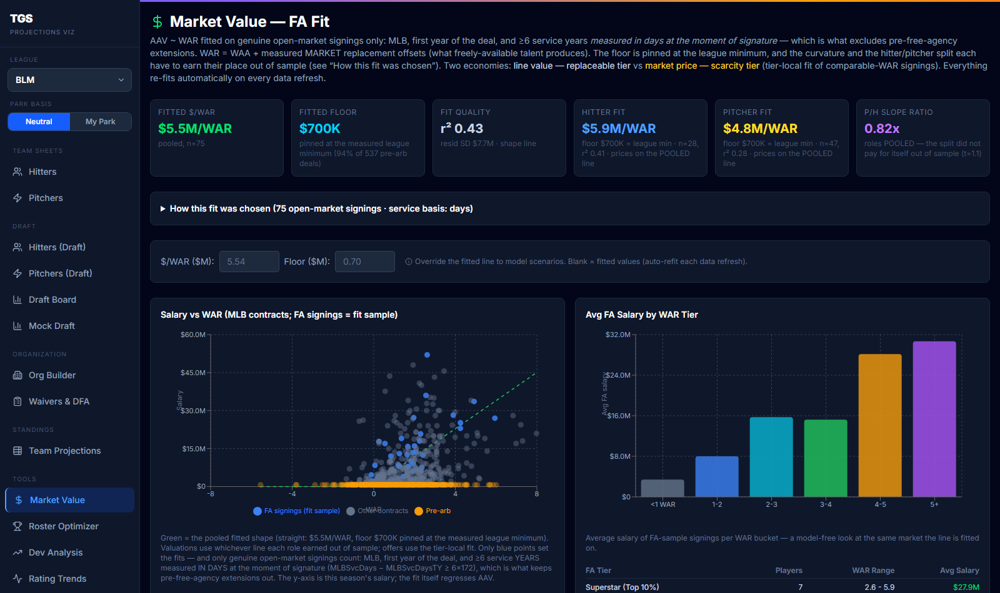
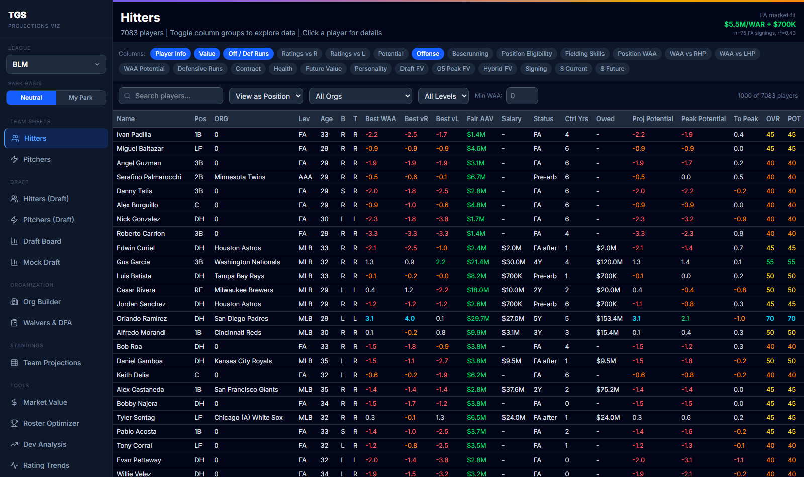

# Perfekt Projections

A full-stack baseball analytics platform for competitive **Out of the Park Baseball** leagues:
a calibrated projection engine fed by thousands of simulated seasons, an ingestion pipeline from
the league's StatsPlus site, and a React dashboard that turns ~16,000 players per league into
roster, draft, and organization decisions.

Built and used live in two online leagues (30 human GMs each). Everything below runs locally
from two batch files.



---

## What it does

**Roster Optimizer** — builds the best 26-man roster from any pool: platoon lineups vs RHP/LHP
weighted by the league's measured plate-appearance share, a 5-man rotation, an 8-man bullpen, and a
bench "contract" (backup C, utility IF, utility OF, flex). Linear, Pythagorean, Monte Carlo, and
durability-adjusted win models.



**Organization Builder** — places every player in a 30-club organization at the level he *should*
be at (MLB through Rookie ball plus a Winter League overlay), using measured per-level talent bars
with hysteresis so players are promoted when they would be top-third at the next level and only
demoted when they fall below the bottom third of their own. Enforces staffing minimums, roster
caps, and a real backup catcher on every affiliate, and tells you exactly which filler to sign when
the system genuinely runs out of bodies.



**Team Projections** — every club's optimized roster projected to a win total, zero-sum across
the league so the standings add up.



**Draft tools** — a Draft Board (age-relative percentile × ceiling × projected peak, with
durability, work ethic, and intelligence flags) and a Mock Draft that slots the *entire* class
from the beginning and shows where every drafted player actually went. Two-way threats are
flagged when both the bat and the arm project above league average. Both boards are built on the
neutral park basis *and* the user's home-park basis, so you draft for the park you play in.

**Rating Trends** — an archive of every ratings pull, biggest risers and fallers, and a measured
development curve: how much a player at each age actually gains before he ages up, computed per
game-year from the archive, only over players with room to grow, split by work ethic,
intelligence, and leadership.



**Market Value** — a $/WAR market fitted to the league's own free-agent signings, contract
control windows, and trade valuation.



**Team sheets** — every hitter and pitcher scored on current and potential value, with the raw
projection stat lines behind every number one click away.



---

## How it works

```
 OOTP league (online)                 OOTP client (local clones)
        │                                       │
        │ ratings + public API                  │ ootp/winsim.py — unattended UI
        ▼                                       │ automation: clone, auto-play
 StatsPlus  ──▶  tgs-viz/ingest/refresh.py      │ 10 seasons, bank the box scores
                        │                       ▼
                        │              tgs-viz/engine/calibrate.py
                        │              fits rating → outcome regressions,
                        │              fielding curves, pitching S-curves,
                        │              run-value currency (per league)
                        ▼                       │
              tgs-viz/engine/  ◀────────────────┘
              hitters.py / pitchers.py: ratings → stat lines → WAA,
              park layer, split-aware potentials
                        │
                        ▼
              tgs-viz/public/data/<LEAGUE>/*.json   ──▶   React app (Vite)
```

- **Projection engine** (`tgs-viz/engine/`) — pure Python, no numpy. Turns 20-80 scouting ratings
  into full stat lines and wins above average, separately against left- and right-handed
  opponents, on a neutral-park basis and a home-park blend. Replaced a 28-pivot Excel regression
  workbook and was validated against it cell for cell (100 of 110 checks exact; the remaining 10
  were Excel's own stale caches).
- **Calibration from simulation** (`ootp/`, `tgs-viz/engine/calibrate.py`) — the game is a black
  box, so the regressions are fitted to its output: `winsim.py` drives the OOTP client with mouse
  and keyboard automation, clones a baseline league, auto-plays ten seasons per clone, clears the
  popups that halt auto-play, and banks the results. One unattended "grind" cycle is ~100 seasons.
  The fitter pools every banked season, refits piecewise regressions and curves, promotes them
  only when the fit clears its checks, and rebuilds the app.
- **Ingestion** (`tgs-viz/ingest/`) — pulls ratings, contracts, injuries, service time, draft
  eligibility, and draft results from StatsPlus; archives every pull as a compressed vintage;
  builds the draft, Rule 5, and international boards. Reports honestly: every step's exit code
  is tracked, the final "data date report" is derived from file timestamps rather than what the
  steps claimed, a wrong-league guard refuses to save a pull that doesn't match the league, and
  cached fallbacks cover API outages (the pick list survived a StatsPlus maintenance window
  mid-draft).
- **Backtesting** (`tgs-viz/backtest/`) — a SQLite history of every ratings pull, per-age-year
  development curves with per-interval contamination guards (a league-wide re-scout between two
  pulls poisons only that interval), and season snapshots frozen against actual results.
- **App** (`tgs-viz/src/`) — React 19, Vite, Tailwind, Recharts. Roster Optimizer, Organization
  Builder, and Team Projections share one optimizer so every screen agrees.

### Measured, not assumed

A recurring theme: wherever a constant could be measured from the game instead of guessed, it was.

- The platoon basis of OOTP's published potential ratings was measured over fully developed
  players — hitters' potentials read on the vs-RHP line, pitchers' on the platoon blend — and both
  engines build split-aware peak lines from each player's own current lean.
- Development is measured per year of age, not per pull: each pull pair's in-game length comes
  from the fraction of players who had a birthday inside it, and a player's change is credited to
  the age he actually was. The measured curve independently confirmed the league's development
  cut-off: gains reach exactly zero at age 25.
- Park factors are read from the league's own export; the "My Park" basis is 50% home park and
  50% the average of the other parks, reproducing the workbook's own park cells to 1e-12.
- The two leagues are calibrated and measured entirely separately; nothing is ever pooled across
  them.

---

## Repository layout

```
perfektprojections/
├── Get StatsPlus Ratings.bat      pull + rebuild everything for the signed-in league
├── Launch TGS.bat                 start the app (http://localhost:3000)
├── Grind TGS.bat / Grind BLM.bat  unattended simulate → recalibrate loop
├── Recalibrate *.bat              refit from every banked season
├── Update Draft Board.bat         rebuild the draft boards from an OOTP pool export
├── Bank Season.bat                freeze projections + fetch actuals for backtesting
├── WHICH BUTTON.docx              the operator's guide: what to run, when
├── STATUS.md                      engineering log / handoff notes
├── ootp/                          OOTP client automation (winsim, clone cleanup)
├── tgs-viz/
│   ├── engine/                    projection engine, calibration, park layer, age curves
│   │   └── calib/<LEAGUE>/        fitted constants and curves per league
│   ├── ingest/                    StatsPlus ingestion, draft / R5 / IAFA boards, pull report
│   ├── backtest/                  ratings history DB, vintages archive, snapshots
│   ├── src/                       React app
│   └── public/data/<LEAGUE>/      generated datasets the app reads
└── The Sheets <LEAGUE>/           the original Excel workbooks (still the source of a few constants)
```

## Running it

Requires Python 3.10+ (plus `openpyxl`) and Node 18+.

```
git clone https://github.com/perfektoa/perfektprojections.git
cd perfektprojections/tgs-viz && npm install
```

Then double-click `Launch TGS.bat`. The repo ships with the current datasets for both leagues, so
the app runs as-is. Refreshing data requires StatsPlus access for the league; the full operator
workflow is in `WHICH BUTTON.docx`.

## Credit

Built on OOTP 26/27's rating system and the original Excel regression work of YourKidnies.
